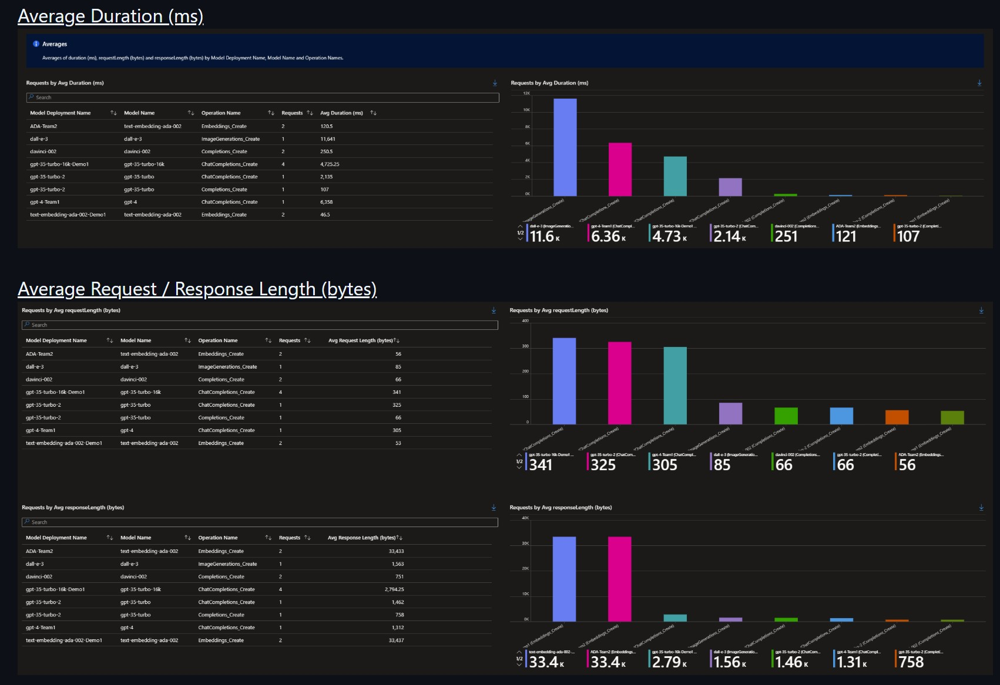

# Secure AI Exploration Environment (Azure Infrastructure + AI Agent)

This is an educational, incremental, and secure-by-default sandbox to learn how Azure infrastructure, security practices, and AI agent development fit together. The repository intentionally exposes each building block (instead of a single one-click deployment) so you can see, reason about, and evolve every layer.


# 🔍 Why This Matters

In cloud-native environments, **speed and safety must coexist**. This framework helps teams avoid the trap of building throwaway PoCs that can't scale—turning early experimentation into strategic value.

# 🧩 Problem Statement

Organizations often struggle when building new Azure environments from scratch, especially for non-production use cases like Proof of Concepts (PoCs), experimentation, or isolated testing. These environments are frequently:

- **Inconsistently designed**, leading to rework when scaling to production.
- **Poorly governed**, increasing risk and cost.
- **Disconnected from enterprise standards**, causing friction with security, compliance, and operations teams.
- **Hard to replicate or automate**, slowing down innovation and collaboration.


## 1. Why This Exists
You can deploy a polished landing zone in minutes—but that often hides the *why* behind each component. When something breaks, or when you need to adapt it, confidence drops. This project takes the opposite path: build a minimal-yet-real foundation step-by-step, layering capabilities while explaining intent, trade‑offs, and next steps.

This is a low cost project, see the references below:
- In the first 7 days: US $7.19 dollars (or, US $1.03 dollars/day for the first 7 days)
- 30 days estiamte: US $ 84.60 dollars (with Virtual Machine up time, more data and more frequent API Calls and logs processed)

Here is the breakdown of the first 7 days cost:
- Virtual Machine: $2.80
- Microsoft Defender for Cloud: $1.80
- Storage: $1.25
- Virtual Network: $1.06
- Azure DNS: $0.19
- Cognitive Services: $0.06
- Log Analytics: $0.03
- Bandwidth: $0.02
  


The **Comprehensive Azure AI PoC Framework** provides a structured, modular approach to build **isolated, scalable, and secure Azure environments** from zero—designed to evolve into production-ready platforms.

It leverages Azure-native services, automation, and governance principles to ensure environments are:

- **Consistent** across teams and use cases.
- **Secure and compliant** from day one.
- **Cost-aware and observable**, even in early stages.
- **Easily extensible** to production workloads.


## 2. Audience

| Role | What You Will Practice |
|------|------------------------|
| Cloud / Platform Engineer | Bicep IaC patterns, idempotent deployments, incremental evolution |
| Software Engineer | Secure service integration, identity-based auth, reproducible environments |
| Security / GRC | Secret hygiene, identity boundaries, future logging & observability tie-ins |
| AI / Data Engineer | Using Azure OpenAI (key vs Entra ID), structured experimentation |

Below are some of the achievements through the proposed methodology so far on this project:

Value 1 - Mesure the Deployment Time and provide inputs for BCDR Plan.


Value 2 - Estimate Regulatory Statndard and Compliance Over Time from Day 1


Value 3 - Evaluate the AI Agent Telemetry and benchmark



## 📈 Business Value Proposition

This framework helps organizations:

### ✅ Reduce Risk
- By embedding security, identity, and governance controls early.
- Avoiding shadow IT and misconfigured environments.

### ✅ Reduce Cost
- Through automated provisioning, tagging, and cost visibility.
- Preventing resource sprawl and unused services.

### ✅ Accelerate Time-to-Value
- By enabling faster experimentation and PoC validation.
- Reducing friction between dev/test and production teams.

### ✅ Reduce Operational Overhead
- With reusable templates and automation pipelines.
- Minimizing manual setup and troubleshooting.

### ✅ Enable Revenue Growth (Indirectly)
- By empowering teams to innovate faster and more safely.
- Supporting faster delivery of customer-facing solutions


## 3. High-Level Architecture (Incremental Build)
Phase 1 provisions a core network + identity boundary. Phase 2 links private DNS, AI Foundry (Cognitive Services account), optional VM, and (future) Log Analytics. Phase 3 introduces the AI agent code with both API key and keyless (Entra ID) authentication patterns.

```text
┌──────────────┐       ┌─────────────────────────────┐
│   Developer  │ -->   │ AI Agent (Python)           │
└──────────────┘       │ - openai Azure client       │
	▲                  │- Entra ID (DefaultAzureCred)│
	│                  └────────────┬────────────────┘
	│                               │
	│                       Private / Public Endpoint
	│                               │
	│                      ┌────────▼────────┐
	│                      │ Azure OpenAI /  │
	│                      │  AI Foundry     │
	│                      └────────┬────────┘
	│                               │
	│                      ┌────────▼────────────┐
	│                      │ Private DNS Zone    │
	│                      └────────┬────────────┘
	|                               │
	│                      ┌────────▼──────────┐
	│                      │ VNet + Subnets    │
	│                      │ (Hub / Spokes)    │
	│                      └────────┬──────────┘
	│                               │
	│                      ┌────────▼──────────┐
	│                      │ Resource Group    │
	│                      └───────────────────┘
```

> The `.vsdx` diagram in `Drawing1.vsdx` can be updated as the system evolves.

## 4. Repository Structure
```
secure_ai/
	01_bicep_resource_base_deployment/
		00_azure_login.ps1              # Auth + create RG if missing
		01_bicep_deploy.ps1             # Generic group deployment driver
		02_vnet_snet.bicep              # VNet + subnets (hub + spokes)
		03_privatedns.bicep             # Private DNS zone + VNet link
		04_azureFoundry.bicep           # AI Foundry (Cognitive Services)
		05_vm.bicep                     # Optional VM (public/private toggle)
		06_azureloganalticswksp.bicep   # (Placeholder) Log Analytics Workspace
	02_AI_Agent/
		gpt4o_llm_api_test_public_key.py        # API key auth pattern (baseline)
		gpt4o_llm_api_test_entra_id_auth.py     # Entra ID (keyless) pattern
		requirements.txt                        # Python deps for agent phase
	quick_ref.txt
	README.md
	Drawing1.vsdx
	00_archive/ (older iterations)
```

## 5. Phased Methodology (Documentation Framework)
Each phase answers four questions: What? Why? How? What Next?

| Phase | Focus | Primary Scripts / Files | Exit Criteria |
|-------|-------|-------------------------|---------------|
| 0 | Prerequisites | Azure CLI, PowerShell, Python env | You can log in & target subscription |
| 1 | Core Network Foundation | `02_vnet_snet.bicep` | VNet + subnets deployed |
| 1.1 | Name Resolution | `03_privatedns.bicep` | Private DNS zone linked |
| 1.2 | AI Service Base | `04_azureFoundry.bicep` | Cognitive account + project present |
| 1.3 | Optional Compute | `05_vm.bicep` | VM reachable (if chosen) |
| 1.4 | Observability Foundation (Planned) | `06_azureloganalticswksp.bicep` | Log Analytics workspace scaffolded |
| 1.5 | Security Posture Baseline | Defender for Cloud (auto policies) | Initial recommendations exported & categorized |
| 2 | AI Agent Auth Patterns | Python scripts in `02_AI_Agent/` | Successful chat completion with key & keyless |
| 3 | Hardening & Scaling (Future) | RBAC, Private Endpoints, Logging | Security review checklist complete |

> Extend by adding a new row + a doc stub in `docs/` (see methodology below).

## 6. Quick Start

### 6.1 Prerequisites

- Azure subscription + permissions to create RG + Cognitive Services
- Installed: Azure CLI (`az`), Bicep (bundled with modern Azure CLI), PowerShell 7+, Python 3.11+
- Login method: Entra ID user or workload identity

### 6.2 Login & Resource Group

```powershell
cd 01_bicep_resource_base_deployment
pwsh ./00_azure_login.ps1 -tenantId <your-tenant-guid> -azResourceGroup <rg-name>
```

### 6.3 Deploy Core Artifacts (Incremental)

Edit `01_bicep_deploy.ps1` to point `$bicepFileName` at each file in sequence:

1. `02_vnet_snet.bicep`
2. `03_privatedns.bicep` (ensure `vnetName` matches previous deployment)
3. `04_azureFoundry.bicep`
4. (Optional) `05_vm.bicep` (decide `deployWithPublicIP` value)
5. (Planned) `06_azureloganalticswksp.bicep`

Run after each change:

```powershell
pwsh ./01_bicep_deploy.ps1
```

### 6.4 Verify Deployments

```powershell
az resource list --resource-group <rg-name> -o table
```

### 6.5 Run AI Agent (API Key Mode)

Create an environment variable instead of hardcoding secrets:

```powershell
$Env:AZURE_OPENAI_KEY = '<your-key>'
```

Update script to read: `api_key = $Env:AZURE_OPENAI_KEY` (planned improvement).

### 6.6 Run AI Agent (Keyless / Entra ID)

Ensure your identity has `Cognitive Services OpenAI User` (or appropriate role) on the account.

```powershell
cd ../02_AI_Agent
python -m venv venv
./venv/Scripts/Activate.ps1
pip install -r requirements.txt
python gpt4o_llm_api_test_entra_id_auth.py
```

Expected: A completion response with travel suggestions.

## 7. Identity & Security Notes

| Topic | Current State | Recommended Next Step |
|-------|---------------|-----------------------|
| Secrets | API key hardcoded in one script | Replace with env var / Key Vault |
| Auth | DefaultAzureCredential works | Add managed identity integration for compute |
| Network | Public endpoints | Add private endpoints + NSGs + DNS forwarding |
| Logging | Placeholder file | Implement Log Analytics + Diagnostic settings |
| RBAC | Implicitly using user context | Document least-privilege roles per phase |
| Posture (CSPM) | Not yet enabled | Enable Defender for Cloud + track recommendations |

## 8. Bicep File Guide

| File | Purpose | Key Parameters | Gotchas |
|------|---------|----------------|---------|
| `02_vnet_snet.bicep` | Base VNet + hub/spoke subnets | Names + CIDRs | CIDR collisions -> adjust early |
| `03_privatedns.bicep` | Private DNS + link | `vnetName` | Location must be `'global'` |
| `04_azureFoundry.bicep` | Cognitive account + project | `aiFoundryName` | Preview API versions may change |
| `05_vm.bicep` | Optional Windows VM | `deployWithPublicIP` | Hardcoded password -> parameterize securely |
| `06_azureloganalticswksp.bicep` | Placeholder | n/a | Implement before observability phase |

## 9. Python AI Agent Patterns

Two contrastive authentication flows are implemented:

| Script | Auth Style | When to Use | Change to Improve |
|--------|-----------|-------------|-------------------|
| `gpt4o_llm_api_test_public_key.py` | Static API key | Quick local smoke tests | Migrate key to env or Key Vault |
| `gpt4o_llm_api_test_entra_id_auth.py` | `DefaultAzureCredential` token | Enterprise / prod alignment | Add retry + structured logging |

Future: Add structured prompt templates, error handling, and metrics.

## 10. Documentation Methodology (How to Keep This Useful)

We treat documentation as code. Each functional change SHOULD:

1. Update the relevant phase section (what changed & why)
2. Add or refine a table row (inputs / outputs / risks)
3. Capture open questions in a "Next Steps" list
4. Avoid duplicating context—link instead

### 10.1 Template for Adding a New Infrastructure Component

Create or update:

```text
docs/components/<component-name>.md
```

Include:

```markdown
# <Component Name>
Purpose:
Depends on:
Parameters:
Security Considerations:
Rollback Strategy:
Future Enhancements:
```

### 10.2 Commit Message Pattern

```text
feat(bicep): add log analytics workspace (phase 1.4)
fix(agent): switch hardcoded key to env variable
docs(readme): expand identity guidance
```

### 10.3 Living Roadmap (Adopt Kanban or Simple List)

Maintain a backlog in `docs/ROADMAP.md`:

```text
- [ ] Add Log Analytics workspace & diagnostic settings
- [ ] Private endpoints for Cognitive Services
- [ ] Key Vault + secret ref in Bicep (remove plaintext password)
- [ ] Managed Identity for VM / future container
- [ ] Add automated tests for Bicep validation (what-if)
- [ ] Observability: capture token usage + latency metrics
```

## 11. Quality & Repeatability Checklist

| Category | Minimal | Mature (Goal) |
|----------|--------|---------------|
| IaC | Manual file switch | Param-driven pipeline invocation |
| Auth | Mixed key + identity | Fully identity-based, zero secrets in repo |
| Secrets | Inline literals | Key Vault + workload identities |
| Testing | Manual `az resource list` | Scripted validation + what-if gating |
| Logging | Not implemented | Centralized + dashboards |
| Governance | Manual review | Policy-as-code (Azure Policy + exemptions) |

## 12. Known Gaps / TODOs

- `06_azureloganalticswksp.bicep` is empty – to be designed (link to workspace, enable diagnostic settings)
- Replace hardcoded VM password & API key with secure parameterization (Key Vault secret reference in Bicep)
- Add network security (NSGs, optional firewall, private endpoints)
- Introduce test harness: Bicep `what-if` + Python smoke test script
- Add Makefile or task runner for repeatable workflows

## 13. Contributing (Internal Learning Mode)

1. Fork / branch naming: `feature/<short-description>`
2. Keep changes atomic (infra vs app vs docs)
3. Run a self-check (lint / what-if / test) before merge
4. Update docs in the same PR

## 14. Security Notice

Remove any embedded subscription keys or passwords before sharing externally. Treat this repository as educational—NOT production-ready—until:

- No secrets are committed
- Private endpoints + controlled egress are enabled
- Centralized logging & monitoring are active

## 15. License / Usage

Currently unspecified (internal learning). Add a LICENSE file if externalizing.

## 16. Appendix: Troubleshooting

| Symptom | Likely Cause | Fix |
|---------|--------------|-----|
| Private DNS deploy fails with invalid location | Used regional location | Use `location: 'global'` |
| `_cffi_backend` import error in Python | Missing compiled deps | Reinstall `cffi` / ensure Build Tools on Windows |
| 403 from Azure OpenAI (keyless) | Insufficient RBAC role | Assign `Cognitive Services OpenAI User` |
| VM deployment password policy failure | Weak password | Use complex `@secure()` parameter + Key Vault |

---
 
## 17. Proactive Security Posture: Microsoft Defender for Cloud

Early visibility into risks turns a Proof of Concept into a guided hardening journey instead of a surprise-laden retrofit. Integrate Microsoft Defender for Cloud (MDC) as soon as the *first* resource group exists so every new asset is continuously assessed.

### 17.1 What Defender for Cloud Provides

| Capability | Value in This Project |
|------------|-----------------------|
| Cloud Security Posture Management (CSPM) | Surfaces misconfigurations (network exposure, weak auth, missing logging) early |
| Defender Plans (selective) | (Optional later) Add threat detection for Compute, Storage, Key Vault, etc. |
| Regulatory Compliance Dashboards | Maps current state to standards (e.g., SOC2 / ISO controls) for storytelling with stakeholders |
| Recommendation Graph | Single pane to prioritize remediation tasks -> becomes your security backlog feed |
| Secure Score | Quantifiable progress metric to tie to project milestones |

### 17.2 Minimal Onboarding Steps (Phase 1.5)

1. In Azure Portal open Defender for Cloud → Environment Settings → select subscription.
2. Ensure the foundational CSPM (free) features are on; defer enabling paid Defender plans until needed.
3. Enable auto-provisioning (only what you will use soon: e.g., Log Analytics agent if required later for legacy scenarios—note AMA / DCR approach is preferred now).
4. Assign the built‑in policy initiative: `Azure Security Benchmark` (or `Defender for Cloud` default) at subscription scope if not already applied.
5. Wait 5–15 minutes; export initial recommendations.

### 17.3 Turning Recommendations into a Backlog

| Recommendation Type | Example (Likely Early) | Backlog Tag | Action Owner |
|---------------------|-------------------------|-------------|-------------|
| Identity | "Guest users present" / missing role scoping | identity | Platform / Security |
| Networking | Public IP on VM | network | Infra engineer |
| Data Protection | No encryption at rest (rare—mostly auto) | compliance | N/A (confirm defaults) |
| Monitoring | Diagnostic logs not enabled | observability | Add to section 18 tasks |
| Secrets | Hardcoded credential usage | secret | Refactor to Key Vault |

Workflow:

1. Weekly snapshot → classify critical / high.
2. Map each to: (a) accept (b) mitigate (c) remediate.
3. Add remediation PRs referencing recommendation ID for traceability.

### 17.4 Using Defender Output to Drive Requirements

| Requirement Category | Derived From | New Acceptance Criterion Example |
|----------------------|-------------|----------------------------------|
| Network Isolation | Exposure recommendations | "All AI Foundry traffic uses private endpoint by Phase 3." |
| Secret Management | Credential exposure findings | "No static keys in repo; Key Vault enforced before prod branch cut." |
| Observability | Missing diagnostics | "All Cognitive Services accounts emit metrics + logs to workspace." |
| Governance | Secure Score delta tracking | "Secure Score >= 60% before enabling public demo access." |

### 17.5 Automation (Future)

| Tool | Purpose |
|------|---------|
| Azure Policy Remediation Tasks | Auto-fix drift (e.g., enforce HTTPS only) |
| Defender for Cloud API / Graph | Export recommendations to backlog (GitHub Actions / DevOps) |
| Workbooks | Visualize Secure Score trend vs. sprint velocity |

### 17.6 Suggested Next Actions

- [ ] Enable CSPM baseline (done once)
- [ ] Export first recommendation set → `docs/security/findings-initial.md`
- [ ] Tag accepted risks with expiration dates
- [ ] Decide which Defender plans (if any) are needed for Phase 3 (e.g., App Service, Key Vault)

## 18. Observability & Log Analytics (KQL + AI Usage Insights)

Foundational observability lets you answer: "Is the model fast? Expensive? Failing more today than yesterday?" This phase introduces a Log Analytics workspace plus diagnostic settings and Azure Monitor metrics for Azure OpenAI / Cognitive Services.

### 18.1 Goals

| Goal | Why It Matters |
|------|----------------|
| Latency Baselines | Tune prompt complexity / temperature vs. performance |
| Token Efficiency | Control cost by comparing input vs. output tokens |
| Error Visibility | Detect throttling (429) or auth issues early |
| Change Impact Tracking | Verify improvements (e.g., caching, prompt refactor) objectively |

### 18.2 Workspace Integration Plan

1. Implement `06_azureloganalticswksp.bicep` to deploy: `Microsoft.OperationalInsights/workspaces`.
2. Add a Data Collection Rule (DCR) (future enhancement) for agent-based sources if needed.
3. For Cognitive Services / AI Foundry: enable diagnostic settings → send to Log Analytics (Categories: `Audit`, `RequestResponse`, `Trace` when available).
4. (Optional) VM: install Azure Monitor Agent targeting same workspace.
5. Tag workspace with `purpose=observability` for inventory clarity.

### 18.3 Sample Bicep Snippet (Workspace Skeleton)

```bicep
resource logAnalytics 'Microsoft.OperationalInsights/workspaces@2022-10-01' = {
	name: 'ai-obs-workspace'
	location: resourceGroup().location
	properties: {
		retentionInDays: 30
		features: {
			enableLogAccessUsingOnlyResourcePermissions: true
		}
	}
	sku: {
		name: 'PerGB2018'
	}
}
```

### 18.4 Enabling Diagnostic Settings (CLI Example)

```powershell
az monitor diagnostic-settings create \
	--name ai-foundry-diag \
	--resource <cognitive-account-resource-id> \
	--workspace $(az resource show -g <rg> -n ai-obs-workspace --resource-type Microsoft.OperationalInsights/workspaces --query id -o tsv) \
	--logs '[{"category":"Audit","enabled":true},{"category":"RequestResponse","enabled":true}]' \
	--metrics '[{"category":"AllMetrics","enabled":true}]'
```

### 18.5 KQL Primer (10% You Use 90% of the Time)

| Pattern | KQL | Usage |
|---------|-----|-------|
| Time bin & count | `Table \| summarize count() by bin(TimeGenerated, 5m)` | Trend volume |
| Filter & summarize | `Table \| where Level == "Error" \| summarize c=count()` | Error totals |
| Percentiles | `Table \| summarize p95=percentile(DurationMs,95)` | Latency SLO check |
| Join | `A \| join kind=leftouter B on CorrelationId` | Correlate traces |

### 18.6 Example Queries

Latency (95th percentile) over 1h:

```kusto
AzureMetrics
| where ResourceProvider == "MICROSOFT.COGNITIVESERVICES"
| where MetricName == "Latency"
| where TimeGenerated > ago(1h)
| summarize p95LatencyMs=percentile(Val, 95) by bin(TimeGenerated, 5m)
| order by TimeGenerated asc
```

Tokens vs. Requests (rolling 24h):

```kusto
AzureMetrics
| where MetricName in ("TotalTokens", "TotalCalls")
| where TimeGenerated > ago(24h)
| summarize total=sum(Val) by MetricName
| evaluate pivot(MetricName, any(total))
| extend TokensPerCall = todouble(TotalTokens) / todouble(TotalCalls)
```

Failure / Throttling patterns:

```kusto
AzureMetrics
| where MetricName == "FailedCalls"
| where TimeGenerated > ago(6h)
| summarize failures=sum(Val) by bin(TimeGenerated, 10m)
| order by TimeGenerated asc
```

Custom (future) application log example (after emitting JSON records):

```kusto
AppLogs
| where Source == "agent.chat"
| project TimeGenerated, deployment, promptTokens, completionTokens, totalLatencyMs
| summarize avgPrompt=avg(promptTokens), avgCompletion=avg(completionTokens), p95Latency=percentile(totalLatencyMs,95) by bin(TimeGenerated, 15m)
```

### 18.7 Visualizing

Create a Workbook with:

1. Latency trend (p95)
2. Tokens per call ratio
3. Failure rate stacked area
4. Cost Estimation panel (Tokens * pricing baseline – manual until Cost Management API integrated)

### 18.8 Incorporating Into Definition of Done

| Criteria | Added When |
|----------|------------|
| Query saved in workspace | After first successful ingestion |
| Workbook dashboard URL documented | After section 18 completion |
| Token baseline captured | Before optimization tasks |
| Alert rule for high latency | Before external demo |

### 18.9 Suggested Next Actions

- [ ] Implement workspace Bicep
- [ ] Enable diagnostics for Cognitive Services account
- [ ] Create initial latency + token queries
- [ ] Build workbook and link in README
- [ ] Add alert rule: p95 latency > 2000ms over 15m
- [ ] Plan custom app logging schema (section 9 future extension)

---
If you add something significant and you're unsure where it belongs—add it to "Known Gaps" and we refine later.

Happy building & learning.

