# AI Environment Testing Guide (Hands-On)

## Overview

Once the Azure resources are deployed using Infrastructure as Code (IaC), it's time to be even more hands on. 
- We start by validating and familiarizing with the environment and acknowleding the uncessary exposure, then we will make it secure. 
- This guide provides step-by-step procedures to test, configure, and verify all deployed components.

So, this is where our state is:
- At this point, all Azure resources should be successfully deployed as shown in the image below. However, they require configuration and validation before they can be used effectively.

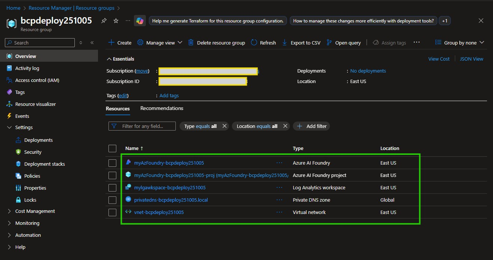
---

## Target Audience are all tribes, this is a big party!

Even if infrastructure management is not your primary role, this guide will help you understand the requirements and perform basic checks to ensure your AI environment is properly configured with appropriate controls and visibility.

This guide is bring all teams together as follows:

- **Azure Solutions Architects** - Validating architecture implementation
- **Azure Administrators** - Configuring and managing deployed resources
- **Software Developers** - Understanding infrastructure capabilities and constraints
- **Data Engineers & Data Scientists** - Preparing the environment for AI workloads
- **Security Engineers** - Ensuring compliance with security best practices
- **C-Suite & IT Managers** - Overseeing project progress and resource allocation

---

## Deployment Benchmark

The complete infrastructure deployment typically completes in **2-4 minutes**, as shown in the benchmark below.
Imagine that this simple but powerful environment is the foundation for your AI workloads, ready to be configured and secured for production use. It also adds the value of making a baseline deployment repeatable and consistent across different environments, ensuring that every deployment adheres to best practices and organizational standards.
- It becomes repeatable, predictable, measurable, consistent, traceable, and reliable for existing users and also a documentation reference for future deployments by new members of the organization.

Observation: 
- The deployment time may vary based on the complexity of the resources being provisioned and the current load on the Azure platform. 
- The 7th deployment is optional (07_vpngateway.bicep) and represents the deployment of the VPN Gateway, which typically takes longer due to backend provisioning processes (~ about 40 minutes on average but in extreme cases, it could take longer).

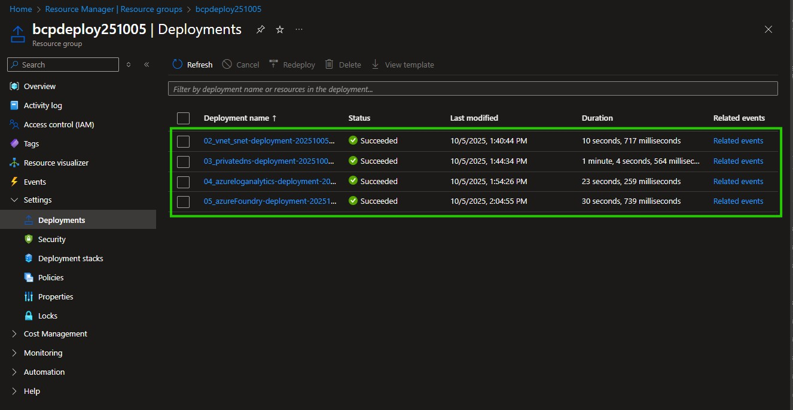
---

## Validation Checklist

Use this checklist to track your validation progress:

| Resource Type | Validation Task | Status | Notes |
|--------------|----------------|--------|-------|
| Resource Group | Verify all resources deployed | ⬜ | Check for missing resources |
| Virtual Network | Validate CIDR ranges and subnets | ⬜ | Confirm no overlaps |
| Subnets | Verify subnet configuration | ⬜ | Hub + 3 spoke subnets |
| Private DNS Zone | Check zone creation and linking | ⬜ | Must be linked to VNet |
| DNS Zone Link | Validate VNet association | ⬜ | Registration should be disabled |
| Log Analytics | Verify workspace creation | ⬜ | Check retention settings |
| Data Collection | Confirm diagnostic settings | ⬜ | Validate data ingestion |
| AI Foundry | Verify Cognitive Services account | ⬜ | Check API keys and endpoint |
| OpenAI Models | Confirm model deployments | ⬜ | GPT-4o, GPT-3.5-turbo, etc. |
| Private Endpoints | Validate private connectivity | ⬜ | Check DNS resolution |
| NSG Rules | Verify security rules | ⬜ | Confirm traffic flow |
| VM Connectivity | Test Bastion/RDP access | ⬜ | Validate admin access |

---

## Section 1: Virtual Network Familiarization

### Objective
Understand and be familiar with the deployed virtual network (VNet) architecture, as typically done and planned for large-scale deployments, including address space, subnets, and network topology and DNS settings.

### Validation Steps

#### 1.1 Navigate to Virtual Network
1. Open the **Azure Portal**
2. Go to your resource group created for this project
3. Navigate to **Virtual Networks**
4. Select your deployed VNet (format: `vnet-<resourceGroupName>`)
5. In the overview page, verify:
   - Name
   - Resource group
   - Location
   - Virtual Network Address space (e.g., `10.2.0.0/16`)
   - Total number of Subnets (We will further check this next, but typically 4: hub + 3 spokes in this project)
   - DNS servers (It should mention "Azure provided DNS service")

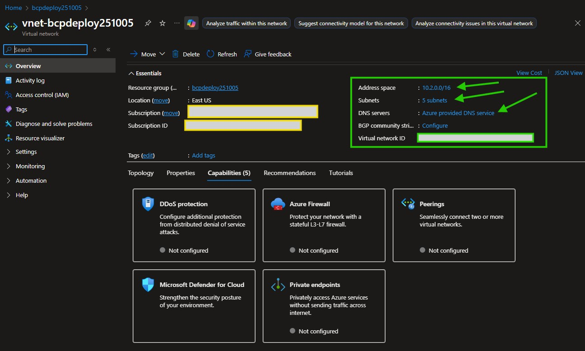

#### 1.2 Review Address Space

Strong foundation, unbeatable project!

No proper IPv4 CIDR planning is a common cause of network conflicts and issues in hybrid or multi-cloud environments, as well when introducing new workloads network in isolation able to communicate with existing resources.

let's ensure the address space is correctly configured and is known to you.

1. In the VNet resource blade, select **Address space** from the left menu under `Settings`.
2. Next, click on **Subnets** from the left menu under `Settings` to view subnet address ranges.
3. Verify the CIDR range in the scope of your project and deployment (e.g. this document used the range: `10.2.0.0/16`)
4. Confirm no overlapping address spaces with other VNets (if applicable).
5. Ask yourself and try to confirm:
   - Is this range suitable for your organization's network architecture public and private IP ranges?
   - Does it avoid conflicts with on-premises or other cloud networks?
   - Is there sufficient IP address space for current and future workloads?
   - Why does SpokeSubnet1vm has less IP addresses than the other subnets?    (Hint: Other workloads deployed here may already be assigned some IPs in this subnet, if so, what are they?)

In case of overlap, with the default IP Range proposed in the bicep file, you can modify the bicep vnet deployment section to use a different range and re-run the deployment. Alternatively, you can also manually adjust the address space in the Azure Portal if no resources are yet deployed as per illustration below. But remember, that will no longer match the IaC definition and re-running the deployment may cause conflicts.

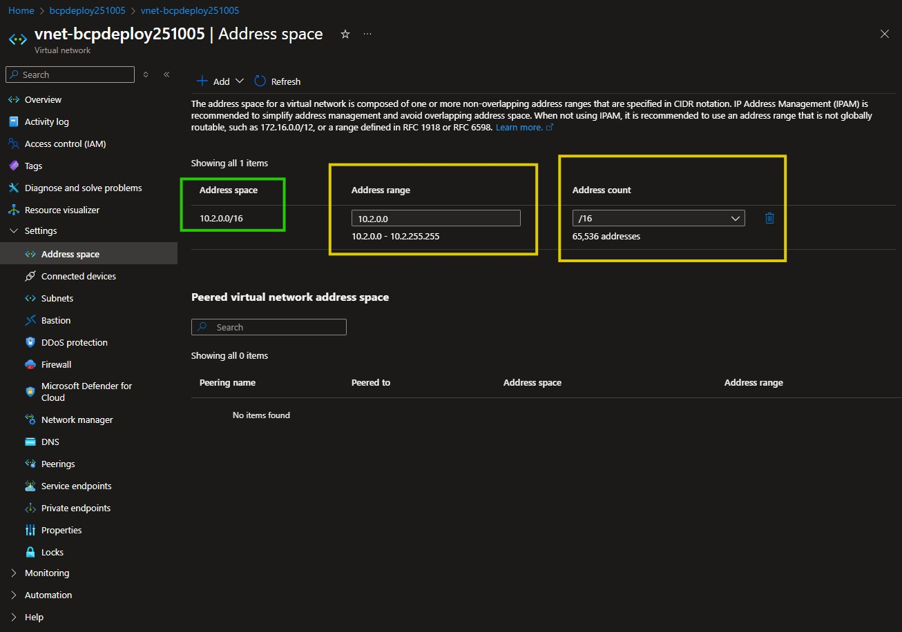

#### 1.3 Validate Subnet Configuration
In the Azure Portal, open the virtual network resource. From the VNet resource blade, select **Subnets** from the left menu.

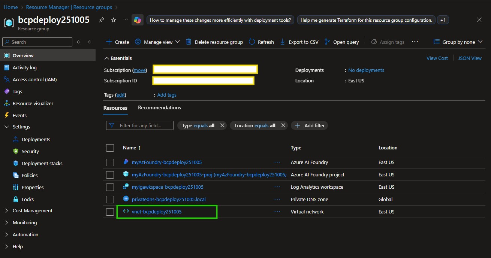

1. Select **Subnets** from the left menu
2. Make a visual check, you should see a total of 5 subnets:
3. Verify the following subnets exist:
   - **GatewaySubnet** - Required for Azure VPN Gateway (we will deploy this later, once we force the traffic for AI services through internal Microsoft backbone network)
   - **hubSubnet** - Central hub for shared services (Firewalls, Bastion, Jumpbox, etc.)
   - **spokeSubnet1vm** - VM workloads
   - **spokeSubnet2app** - Application hosting (App Service, Container Instances)
   - **spokeSubnet3privateEndpoint** - Access to all Azure Services. This has been chosen in this projects as the access by other application to AI services (Azure OpenAI, AI Foundry) via private endpoints, forcing the traffic through internal Microsoft backbone network.

4. For each subnet, confirm:
   - Address range
   - Number of available IP addresses on each range (used vs total)
   - Service endpoints (if already configured)
   - Delegation settings

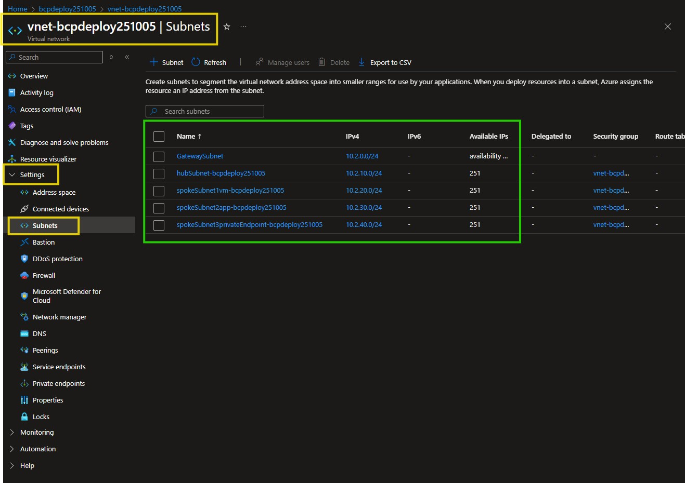

#### 1.4 Check your VNET Association with DNS Private Zone

Why private DNS zone association is important?

Imagine trying to call your AI services (like Azure OpenAI) from your applications without the ability to resolve their private IP addresses. The value is that it enables secure and efficient communication between your applications and the AI services without exposing them to the public internet and concerns about static IP changes. 
- Without proper DNS resolution, your applications would struggle to connect to these services securely and efficiently. 
- Especially when using private endpoints, DNS resolution is crucial to ensure that your applications can locate and communicate with the services over the private network.

The private DNS association with your VNET allows the resolution of private endpoint FQDNs to private IP addresses within your VNet. The value of having this now, later on is that it will make it super simple for your applications to reach the AI services via private endpoints later on.

As resource is already deployed via bicep, we will keep this check simple.
- Here we will just make a quick check and make you aware on the automated bicep deployment for the VNET in association to the DNS private zone service during your deployment design.

Follow these steps to verify the DNS server settings for your VNet resource:

1. In the Azure Portal, navigate to your Virtual Network (VNET) resource in the resource group.
2. From the VNet resource blade, select **DNS servers** from the left menu.
3. Confirm DNS server configuration:
   - **Default (Azure-provided)** - For automatic private endpoint resolution (this is the trick to make it work seamlessly private AI Service API calls via Microsoft backbone network)
   - OR **Custom** - If using custom DNS forwarders.
4. Verify that Auto-registration is set to **Enabled** for the private DNS zone (for privatelink zones). That means that the VNet is linked to the private DNS zone and can resolve the private endpoint names.

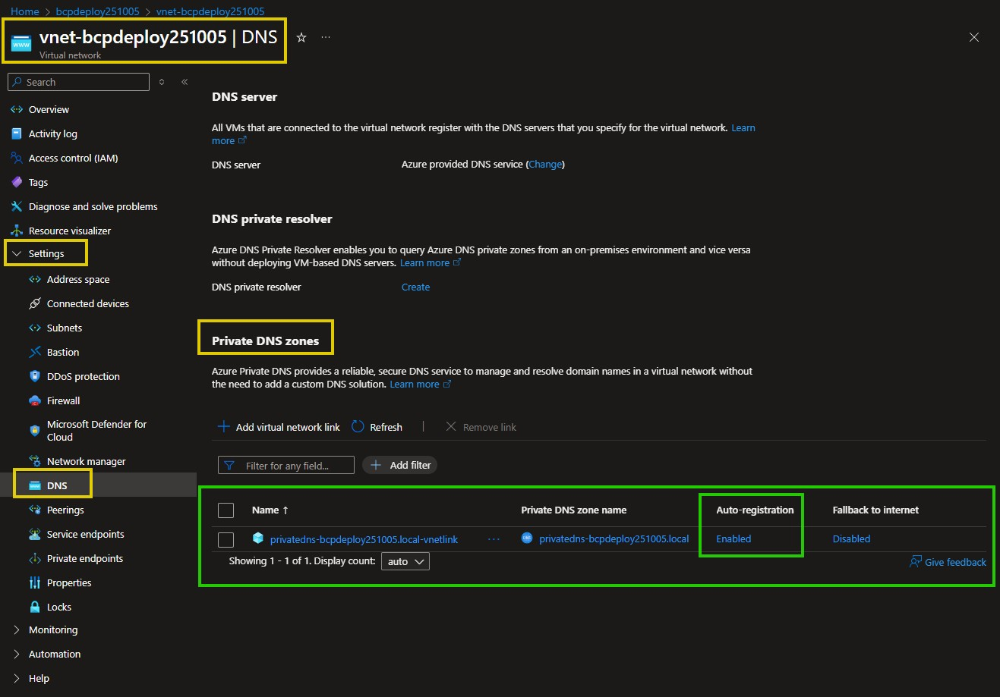

#### 1.5 (Optional) Check Network Security Groups (NSG) -  not initially implemented

Why this optional NSG enablement is valuable?

- It allows for more granular control over network traffic and can help to mitigate potential security risks. 

For analogy, think of NSGs as local security guards at the entrance of each subnet, ensuring that only authorized traffic is allowed in and out based on predefined rules will have access to that room of the house. 

Important! 
- While local guards (NSGs) control access at the room level, a central security system (Azure Firewall) oversees the entire property, providing a broader layer of security and monitoring.

To set some limits on network traffic, NSGs are typically used.

We have intentionally kept the NSG rules as optional, hence this is out of initial deployment to allow flexibility during testing and configuration.

In a production environment, it's crucial to implement strict NSG rules to enforce the Zero Trust security model, as this does not overlap with Azure Firewall appliances. They complement each other because NSGs control traffic at the network interface level, while Azure Firewall provides a centralized point for logging and policy enforcement.

If you have already configured NSG rules, verify you can follow the steps below:

1. Review NSG associations for each subnet
2. Verify inbound and outbound security rules
3. Confirm default deny rules are in place

---

## Section 2: Private DNS Zone Configuration Check

### Objectives

Validate Private DNS Zone deployment and VNet integration for private endpoint name resolution and become familiar with the Private DNS Zone deployment at basic level in this project.

### Validation Steps

#### 2.1 Locate Private DNS Zone

1. In the Azure Portal, navigate back to your resource group created for this project and identify the **Private DNS zone** resource created.
2. Identify your deployed zone (e.g., `privatelink.openai.azure.com`)
3. Note the zone name and resource group

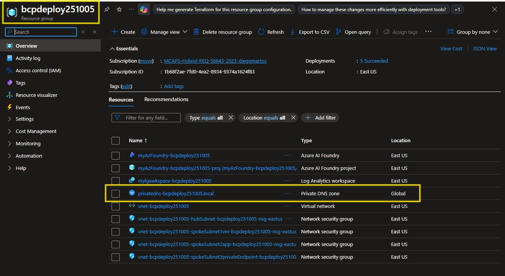

#### 2.2 Verify VNet Link

Why is this valuable?

Verify VNet Link means checking that your private DNS zone (a secure name directory for internal resources) is correctly connected to your virtual network (VNet).

Reliable Connectivity: Ensures all internal systems can “find” each other easily, like having a complete phone book for your company’s private network.

- Automation: Auto-registration saves time and reduces human error—new services are discoverable instantly.
- Security & Control: Keeps everything inside your private environment, reducing exposure to the public internet.

Perform the following checks:

1. In the Private DNS zone blade, in the **DNS Management** section, select **Virtual network links**
2. Confirm the VNet link exists
3. Verify the following settings:
   - **Link status**: Completed
   - **Virtual network**: Your deployed VNet
   - **Auto-Registration** is set to enabled (for privatelink zones)


#### 2.3 (Optional) Test DNS Resolution

At this point you have Azure AI foundry Services that allows you to deploy AI models. 

In order to test this extra step you will have to skip to section down below and make sure you have an AI Model Deployed to validate the API DNS Resolution.

- Got to Section 4: Azure AI Foundry Configuration below: here is the link to this section: [Section 4: Azure AI Foundry Configuration](#section-4-azure-ai-foundry-configuration)

If you have a VM deployed, test DNS resolution:

```bash
# From Windows VM (PowerShell)
Resolve-DnsName <your-openai-resource>.openai.azure.com

# From Linux VM (bash)
nslookup <your-openai-resource>.openai.azure.com
```

Expected result: Private IP address from your VNet range

---

## Section 3: Log Analytics Workspace Validation

The main value of Log Analytics is to provide a centralized platform for collecting, analyzing, and visualizing log and performance data from various Azure resources. 

The value of a proper Log Analytics implementation is multi-fold:

- **Proactive Monitoring**: Enables real-time insights into your AI environment's health and performance.
- **Troubleshooting**: Simplifies root cause analysis with rich query capabilities.
- **Optimization**: Identifies areas for improvement, helping to fine-tune resource usage and performance.
- **Compliance and Auditing**: Maintains logs for security audits and compliance requirements.
- **Cost Management**: Tracks resource consumption, aiding in budget management and cost optimization. Allowing for resource lifecycle management and optimization proactively rather than reactively.

### Objective

Verify Log Analytics Workspace deployment, data retention settings, and diagnostic data collection.

### Validation Steps

Don't worry you won't get bored, this is quick and easy and is extremely powerful and easy to understand, as it has been deployed via IaC using bicep already

#### 3.1 Access Log Analytics Workspace

1. From your Azure resource group created to this project, navigate to **Log Analytics workspaces** in the Azure Portal
2. Select your deployed workspace
3. Review the **Overview** page for:
   - Workspace ID
   - Resource group
   - Location
   - Pricing tier (Should show Pay-As-You-Go, typically `PerGB2018`)
   - Operational Issues

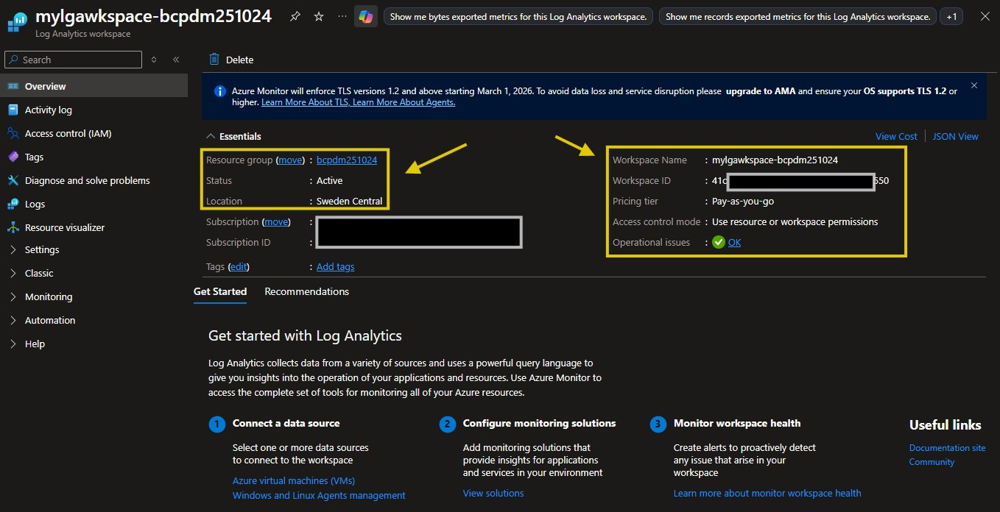

#### 3.2 Verify Retention Settings

A common oversight is not configuring data retention policies, which can lead to many easy to avoid issues including but not limited to:

- Inadequate or excessive log retention for compliance audits and troubleshooting;
- Unexpectedly high storage costs due to indefinite data retention;
- Difficulty in managing and analyzing large volumes of log data over time.

To ensure proper data retention settings per your organization's requirements, follow these steps:

1. In the workspace blade, navigate in the left menu under ``settings`` and select **Usage and estimated costs**
2. Click **Data retention**
3. Confirm retention period (default: 30 days)
4. Check daily cap settings (quota management)

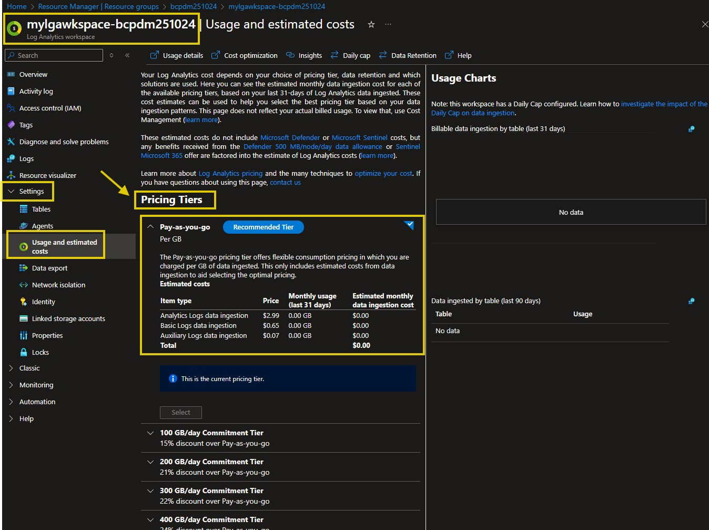

#### 3.3 Check Diagnostic Settings

The value of enabling diagnostic settings is that it allows you to collect and analyze logs and metrics from your Azure resources. 

From my personal experience, this has been invaluable for troubleshooting and optimizing resource performance. Hence providing insights into their performance against design and operational expectations, health, and security.

- This proactive monitoring helps in identifying issues early, optimizing resource usage, and ensuring compliance with organizational policies.

Follow these steps for each of the resources you plan to enable diagnostics and gain valuable insights from

To verify diagnostic settings for each of your resources:

1. In your project resource group, navigate to your deployed resources (VNet, OpenAI, App Service, etc.)
2. For each resource, typicaly on the resource left blade at the lower part, under the ``monitoring`` section, select **Diagnostic settings** as per resource illustration below.
3. Verify that logs and metrics are being sent to Log Analytics created for this project. - Consider enabling for the resource below (intentionally not configured during deployment for familiarization and cost control):
   - Azure OpenAI / AI Foundry
   - App Service
   - Virtual Network
4. (optional but totally worth it) If not configured, create a new diagnostic setting:
   - Click **+ Add diagnostic setting**
   - Name the setting (e.g., `diag-<resource-name>`)
   - In the ``Destination details`` sextion, select **Send to Log Analytics workspace**
   - Choose your Log Analytics workspace
5. Confirm the following log categories are enabled:
   - **Azure AIFoundry**: Audit, RequestResponse, Trace, AllMetrics
   - **App Service**: AppServiceHTTPLogs, AppServiceConsoleLogs, AppServiceAppLogs
   - **Virtual Network**: VMProtectionAlerts
6. Click **Save**

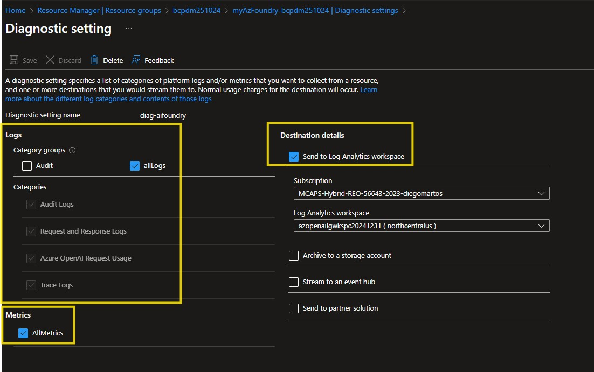

#### 3.4 Query Sample Data
1. Either from the Log Analytics workspace, or from your other Azure resources enabled with log analytics, in the left blade menu, typically under ``monitoring``, select **Logs**
2. Close the introduction pane if it appears, look for the ``X`` mark in the top right corner.
3. Run a sample query to verify data ingestion, here is one for Azure OpenAI requests and one for App Service logs if you have done tests.:

If you have not done any tests yet, you can skip this step for now and come back later once you have done some API calls to Azure OpenAI from your App Service application and come back laters

```kql
// Kusto Query Language (KQL) sample for Azure OpenAI requests
// Use this to check recent Azure OpenAI requests
AzureDiagnostics
| where ResourceType == "COGNITIVESERVICES"
| where Category == "RequestResponse"
| take 10
| project TimeGenerated, OperationName, ResultType, DurationMs
```

```kql
// Check App Service logs
AppServiceHTTPLogs
| take 10
| project TimeGenerated, CsMethod, CsUriStem, ScStatus, TimeTaken
```


---

## Section 4: Azure AI Foundry Configuration

### Objectives

Validate Azure AI Foundry (Cognitive Services) deployment, model availability, and API endpoint configuration.

### Langugage Model Deployment Steps

1. In the Azure portal, navigate to your AI Foundry resource.
2. From the left blade menu, select **Projects**, you will see a default project created during deployment (e.g., `default-project` or `your-custom-project-name`).
3. Select your project to open it, and Click on ``Go to Azure AI Foundry portal``. **Deployments** from the left menu.
4. Click **+ Add deployment** to create a new model deployment.
5. Choose the model you want to deploy (e.g., GPT-4o, GPT-3.5-turbo).
6. Configure the deployment settings (e.g., name, scale).
7. Click **Create** to deploy the model.

### Validation Steps

#### 4.1 Access AI Foundry Resource
1. Navigate to **Azure AI services** or **Cognitive Services**
2. Select your deployed AI Foundry resource
3. Review the **Overview** page


#### 4.2 Verify Deployed Models
1. In the AI Foundry blade, select **Model deployments** (or **Deployments**)
2. Confirm the following models are deployed:
   - **GPT-4o** - For advanced reasoning tasks
   - **GPT-3.5-turbo** - For general-purpose chat
   - **text-embedding-ada-002** - For embeddings (optional)

3. For each model, note:
   - Deployment name
   - Model version
   - Capacity (Tokens Per Minute - TPM)


#### 4.3 Retrieve API Keys and Endpoint
1. Select **Keys and Endpoint** from the left menu
2. Copy the following information (store securely):
   - **Endpoint URL**: `https://<resource-name>.openai.azure.com/`
   - **Key 1**: Primary API key
   - **Key 2**: Secondary API key (for key rotation)
   - **Location**: Azure region


> **Security Best Practice**: Use **Key Vault** to store API keys. For production workloads, use **Managed Identity** instead of API keys.

#### 4.4 Configure Managed Identity (Recommended)
1. In the AI Foundry blade, select **Identity**
2. Enable **System assigned** managed identity
3. Set status to **On**
4. Click **Save**
5. Navigate to **Access control (IAM)**
6. Add role assignment: **Cognitive Services OpenAI User**
7. Assign to your App Service or VM managed identity


#### 4.5 Test API Connectivity
Use the Azure AI Studio or Postman to test API calls:

**Sample Request (REST API):**
```bash
curl https://<your-resource>.openai.azure.com/openai/deployments/<deployment-name>/chat/completions?api-version=2024-12-01-preview \
  -H "Content-Type: application/json" \
  -H "api-key: <your-api-key>" \
  -d '{
    "messages": [{"role": "user", "content": "Hello, Azure OpenAI!"}],
    "max_tokens": 50
  }'
```

**Sample Request (Python with API Key):**
```python
from openai import AzureOpenAI

client = AzureOpenAI(
    azure_endpoint="https://<your-resource>.openai.azure.com/",
    api_key="<your-api-key>",
    api_version="2024-12-01-preview"
)

response = client.chat.completions.create(
    model="<deployment-name>",
    messages=[{"role": "user", "content": "Hello, Azure OpenAI!"}]
)

print(response.choices[0].message.content)
```

**Sample Request (Python with Managed Identity):**
```python
from openai import AzureOpenAI
from azure.identity import DefaultAzureCredential, get_bearer_token_provider

credential = DefaultAzureCredential()
token_provider = get_bearer_token_provider(
    credential, "https://cognitiveservices.azure.com/.default"
)

client = AzureOpenAI(
    azure_endpoint="https://<your-resource>.openai.azure.com/",
    azure_ad_token_provider=token_provider,
    api_version="2024-12-01-preview"
)

response = client.chat.completions.create(
    model="<deployment-name>",
    messages=[{"role": "user", "content": "Hello, Azure OpenAI!"}]
)

print(response.choices[0].message.content)
```

---

## Section 5: Private Endpoint Validation

### Objective
Verify that private endpoints are correctly configured for secure, private connectivity to Azure services.

### Validation Steps

#### 5.1 Locate Private Endpoints
1. Navigate to **Private endpoints** in the Azure Portal
2. Identify private endpoints for:
   - Azure OpenAI / AI Foundry
   - Azure App Service (if configured)
   - Key Vault (if configured)

#### 5.2 Verify Private Endpoint Configuration
For each private endpoint, check:
1. **Connection state**: Approved
2. **Network interface**: Has a private IP from your VNet
3. **DNS configuration**: Private DNS zone integration enabled
4. **Subnet**: Deployed in the correct subnet

#### 5.3 Test Private Connectivity
From a VM in the same VNet:

```powershell
# Test DNS resolution (should return private IP)
Resolve-DnsName <resource-name>.openai.azure.com

# Test connectivity
Test-NetConnection -ComputerName <resource-name>.openai.azure.com -Port 443
```

---

## Section 6: Virtual Machine Access

### Objective
Validate VM deployment and establish secure access using Azure Bastion or RDP.

### Validation Steps

#### 6.1 Access VM via Azure Bastion
1. Navigate to your deployed **Virtual Machine**
2. Click **Connect** → **Bastion**
3. Enter your admin credentials
4. Click **Connect**

#### 6.2 Verify VM Configuration
Once connected, verify:
- Windows Server version (should be 2022 Datacenter)
- Network configuration (private IP from correct subnet)
- Internet connectivity (if required)
- Azure CLI installed (optional for testing)

#### 6.3 Test Network Connectivity
From the VM, test connectivity to Azure services:

```powershell
# Test Azure OpenAI endpoint
Test-NetConnection -ComputerName <resource-name>.openai.azure.com -Port 443

# Test private DNS resolution
Resolve-DnsName <resource-name>.privatelink.openai.azure.com
```

---

## Section 7: Monitoring and Observability

### Objective
Set up monitoring dashboards and alerts for proactive management of the AI environment.

### Validation Steps

#### 7.1 Create Log Analytics Dashboard
1. Navigate to **Log Analytics workspace**
2. Select **Workbooks** (or **Dashboards**)
3. Create a new workbook with visualizations for:
   - Azure OpenAI request volume
   - Token usage and costs
   - Error rates
   - Response times

#### 7.2 Configure Alerts
Set up alerts for critical events:

1. Navigate to **Alerts** in your resources
2. Create alert rules for:
   - **High error rate** (OpenAI 4xx/5xx responses)
   - **Quota exceeded** (TPM limits reached)
   - **High latency** (response time > threshold)
   - **Unauthorized access attempts**

#### 7.3 Sample KQL Queries for Monitoring

**Token Usage Tracking:**
```kql
AzureDiagnostics
| where ResourceType == "COGNITIVESERVICES"
| where Category == "RequestResponse"
| extend tokens = toint(properties_s)
| summarize TotalTokens = sum(tokens) by bin(TimeGenerated, 1h)
| render timechart
```

**Error Rate Analysis:**
```kql
AzureDiagnostics
| where ResourceType == "COGNITIVESERVICES"
| where Category == "RequestResponse"
| summarize 
    Total = count(),
    Errors = countif(ResultType == "Failed")
    by bin(TimeGenerated, 5m)
| extend ErrorRate = (Errors * 100.0) / Total
| render timechart
```

---

## Section 8: Security Validation

### Objective
Verify that security controls are properly configured according to the Zero Trust model.

### Validation Steps

#### 8.1 Network Security
- [ ] All public endpoints disabled (OpenAI, Key Vault, Storage)
- [ ] Private endpoints configured and approved
- [ ] NSG rules limit traffic to required ports only
- [ ] VNet integration enabled for App Service

#### 8.2 Identity and Access Management
- [ ] Managed identities configured for all services
- [ ] RBAC roles assigned with least privilege
- [ ] API keys stored in Key Vault (not hardcoded)
- [ ] Azure AD authentication enabled

#### 8.3 Data Protection
- [ ] Encryption at rest enabled (default)
- [ ] TLS 1.2+ enforced for all connections
- [ ] Diagnostic logs enabled for all resources
- [ ] Log Analytics retention configured

#### 8.4 Compliance
- [ ] Microsoft Defender for Cloud enabled
- [ ] Compliance score reviewed
- [ ] Security recommendations addressed
- [ ] Vulnerability assessments completed

---

## Troubleshooting Common Issues

### Issue 1: DNS Resolution Fails for Private Endpoints
**Symptom**: `nslookup` returns public IP instead of private IP

**Solution**:
1. Verify Private DNS zone is linked to VNet
2. Check that VNet DNS settings are set to "Default (Azure-provided)"
3. Ensure private endpoint DNS integration is enabled

### Issue 2: Cannot Connect to Azure OpenAI
**Symptom**: Connection timeout or 403 Forbidden errors

**Solution**:
1. Verify network path (VNet → Subnet → Private Endpoint)
2. Check NSG rules allow outbound HTTPS (443)
3. Confirm RBAC role assignment (Cognitive Services OpenAI User)
4. Validate API key or managed identity configuration

### Issue 3: No Data in Log Analytics
**Symptom**: KQL queries return no results

**Solution**:
1. Check diagnostic settings are configured
2. Verify log categories are enabled
3. Wait 5-15 minutes for initial data ingestion
4. Confirm workspace ID is correct

### Issue 4: VM Cannot Be Accessed
**Symptom**: Bastion connection fails

**Solution**:
1. Verify VM is running
2. Check NSG allows inbound from AzureBastionSubnet
3. Confirm admin credentials are correct
4. Ensure Bastion subnet is properly configured (/26 or larger)

---

## Next Steps

After completing this validation guide:

1. **Deploy Application Workloads**: Use the validated infrastructure to deploy your AI applications (see `instructions.md`)
2. **Implement CI/CD**: Set up automated deployment pipelines using Azure DevOps or GitHub Actions
3. **Scale Resources**: Adjust VM sizes, App Service plans, and OpenAI TPM quotas based on workload requirements
4. **Optimize Costs**: Review Azure Advisor recommendations and implement cost-saving measures
5. **Enhance Security**: Enable Microsoft Defender for Cloud and implement additional security controls

---

## Conclusion

You have now validated all critical components of your secure Azure AI environment. The infrastructure is ready for production workloads with proper networking, security, monitoring, and observability in place.

For questions or issues, refer to:
- [README.md](README.md) - Complete project documentation
- [instructions.md](instructions.md) - Application deployment guide
- [Azure Documentation](https://learn.microsoft.com/azure/)
